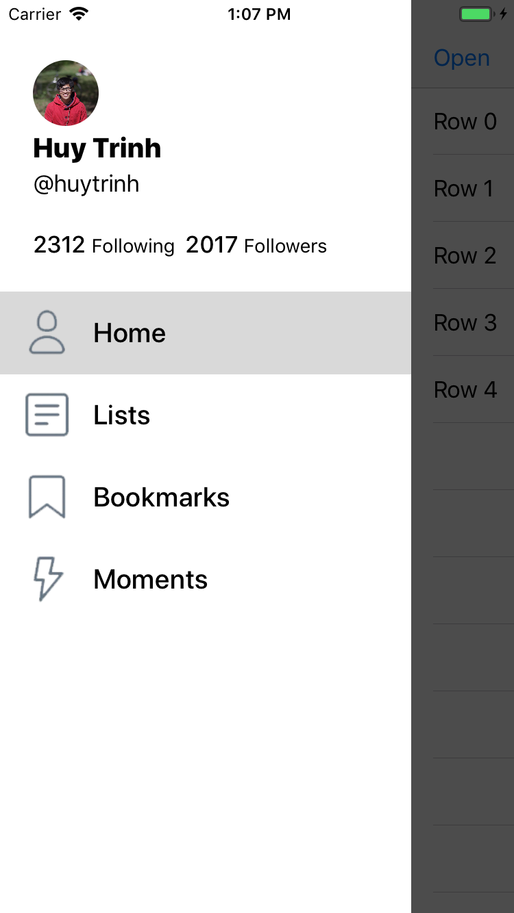
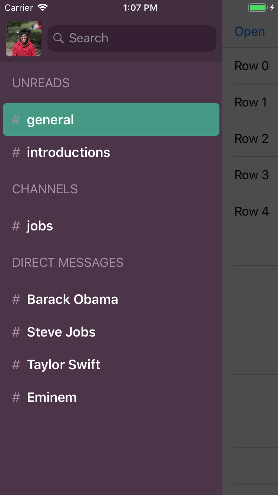

# Jupiter

This small project demonstrates how to create a slide out menu in iOS

## Features
:white_check_mark: Swift 4.2  
:white_check_mark: Slide Out Menu  
:white_check_mark: Pan Gesture  
:white_check_mark: Animation and Custom View  
:white_check_mark: UI Programatically (No Storyboard)  

## Screenshots

| Menu1     | Menu2   | 
| :-------------: | :-------------: | 
|  |  |

